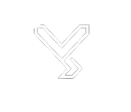

# Vessel Vision
Project repo for Internship
# 🩺 Vessel Vision – Precision Medical Diagnostics

<p align="center">
  
</p>

<p align="center">
  <strong>AI-Powered Medical Imaging Platform for Faster, Smarter, and More Accurate Diagnosis.</strong>
</p>

<p align="center">
  <a href="https://clinquant-paletas-e7f448.netlify.app/">
    
  </a>
  
  
</p>

---

## 📖 About

**Vessel Vision** is a modern healthcare web platform designed to showcase AI-powered medical diagnostic solutions.

The project focuses on delivering a clean, responsive, and user-friendly experience while presenting advanced AI technologies that assist healthcare professionals in improving diagnostic accuracy and efficiency.

---

## ✨ Features

* 🩺 Modern Healthcare Landing Page
* 🤖 AI-Based Medical Diagnostics
* 📱 Fully Responsive Design
* ⚡ Fast & Lightweight
* 🎨 Clean and Professional UI
* 📚 Blog Section
* 📞 Contact Page
* ℹ️ About Page
* 📅 Book Demo CTA
* 🌙 Mobile-Friendly Navigation

---

## 🖥️ Live Demo

👉 https://clinquant-paletas-e7f448.netlify.app/

---

## 📸 Preview

> Add screenshots here after deployment.

```text
Desktop Preview

+-----------------------------------------------------------+
| Logo     Home   Blog   About   Contact     Book Demo      |
+-----------------------------------------------------------+

Modern AI Healthcare Landing Page
```

---

## 🛠️ Built With

* HTML5
* Tailwind CSS
* JavaScript
* Google Material Symbols
* Netlify

---

## 📂 Project Structure

```
Vessel-Vision/
│
├── index.html
├── script.js
├── style.css
├── vvlogo.png
└── assets/
```

---


## 🎯 Project Goals

* Build a professional healthcare website
* Improve accessibility and responsiveness
* Demonstrate modern UI/UX principles
* Showcase AI-powered medical solutions
* Deliver a production-ready landing page

---

## 🤝 Contributing

Contributions are welcome.

1. Fork the repository
2. Create a new branch


## 👨‍💻 Contributors

* Aftab Aalam
* Mahi Priyadarshi

---

## ⭐ Support

If you found this project useful, please consider giving it a ⭐ on GitHub.

It helps the project reach more developers and motivates future improvements.

---

<p align="center">
Made with ❤️ by Team AFTAB and MAHI
</p>
